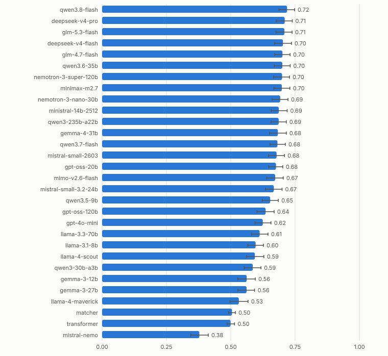
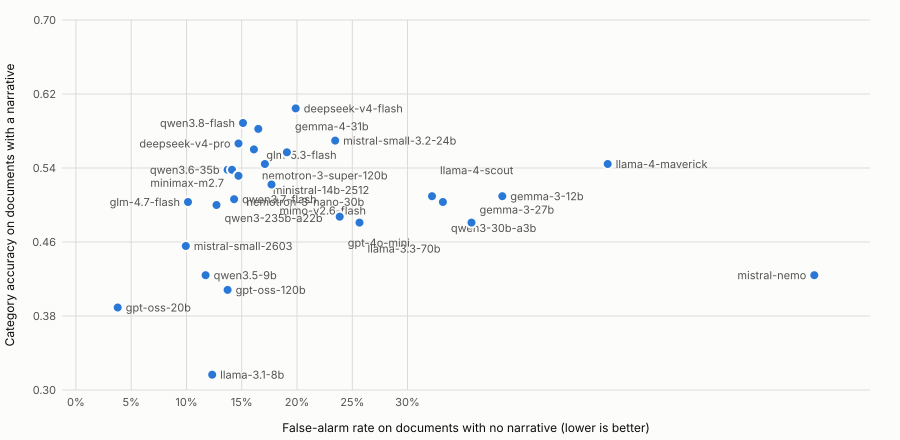
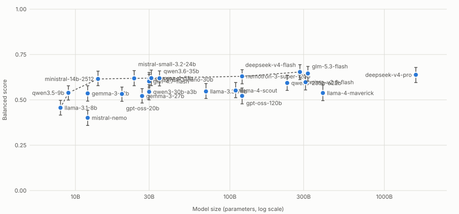
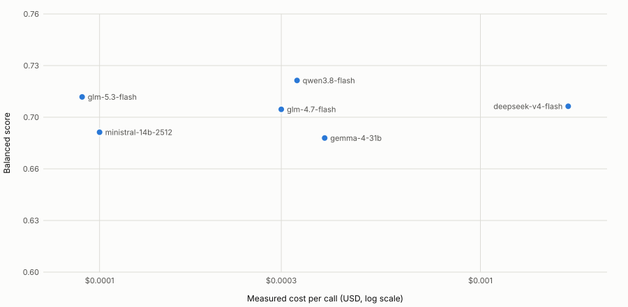

# Choosing a model for CARDS classification

This report records how 32 classifiers were compared for labelling claims with the CARDS misinformation taxonomy, what the numbers say, and what they do not say. The README links to it; the raw numbers are in [model-selection/results.csv](model-selection/results.csv) and the charts can be rebuilt from a saved run with [model-selection/make_plots.py](model-selection/make_plots.py).

## Summary

- **No model is clearly the best.** Roughly the top ten LLMs are statistically tied (95% intervals overlap by a wide margin), so the choice comes down to cost, speed, openness and which kind of mistake you can tolerate.
- **Two kinds of mistake trade against each other.** A model can flag too many documents that carry no denial narrative (false alarms), or miss real narratives. Prompts, the ClimateBERT gate and model choice all move along that trade-off more than they improve both at once.
- **Size stops mattering at about 14B parameters.** Between 14B and 1.6T the scores are flat within noise. Below 10B they fall clearly.
- **Cost per call varies about 20-fold between models of similar quality** (measured, not list price). Catalog list prices are a poor guide: reasoning models bill many more tokens than the price suggests.
- **A tuned prompt did not give a dependable gain.** One model gained significantly, and only for the exact text the optimiser returned.

| If you want | Take | Why |
| :---------- | :--- | :-- |
| Lowest cost among the top group | `glm-5.3-flash` | Balanced score 0.645 (third), about $0.00009 per call, no failures. Open weights, MIT licence, 320B total and 18B active parameters (model card), so hosted only for most people. |
| Highest balanced score | `qwen3.8-flash` | 0.654 (tied with `deepseek-v4-flash`), about $0.00033 per call; open weights not confirmed |
| Highest category accuracy | `deepseek-v4-flash` | 0.604 on documents with a narrative, but the most false alarms of the finalists (19.9%) and about $0.0017 per call |
| Fastest | `gemma-4-31b` or `ministral-14b-2512` | About 5 s per call; gemma has 19% false alarms, ministral 17% |
| Smallest that still holds up | `ministral-14b-2512` | 14B, balanced 0.616, fits a 16 GB GPU or Mac at 4-bit |

These are tie-breaks, not wins: pick by the column that matters to you.

## What was measured

**Data.** Three benchmarks, claim text only (no review context): `climatesense_v1` (398 documents), `climatesense_v2` (277) and the NSLP/ClimateCheck test split (172), 847 documents in all. 503 of them (59%) carry no denial narrative (code `0_0`) and 316 carry a category. 28 more have a gold set that ties a category with `0_0`; they are left out of both measures below. 114 documents have tied gold labels overall, and a prediction counts as right if it matches any of them. Gold labels come from annotators who saw only the claim.

**Models.** 30 LLMs served through OpenRouter, plus the free `transformer` and `matcher` engines as baselines. One prompt (the `xplainnlp-nslp` preset), temperature 0, ClimateBERT gate off, structured output (prompted output where a model needs it). Configuration: [`eval.suite.toml`](../eval.suite.toml). `ling-3.0-flash` (answers "no narrative" for nearly everything) and `mistral-large-2512` (failed items from upstream rate limits) are left out of the charts.

**Two questions, scored separately.** CARDS code `0_0` means "no denial narrative". So a classifier answers two things:

1. *Is there a narrative at all?* Measured on the documents with no narrative as the **false-alarm rate**: the share given a category.
2. *Which category, when there is one?* Measured as **category accuracy** on the documents that carry a category: the answer is an accepted gold label. A missed narrative counts as wrong here.

The **balanced score** used for ranking is `0.75 × category accuracy + 0.25 × (1 − false-alarm rate)`, pooled over all 847 documents, with a bootstrap 95% interval. The weights are a judgement: the texts to be labelled are mostly claims already known to be misinformation, so a missed narrative is treated as three times as costly as a false alarm. [Weighting and the base rate](#weighting-and-the-base-rate) shows how the ranking moves with other weights. Plain exact match over all documents is a poor ranking here, because 59% of documents have no narrative, so a model that says "no narrative" often looks good (`gpt-oss-20b` tops it while scoring 0.39 category accuracy). The full benchmark tables (exact match, hierarchical F1, narrative-detection precision and recall, per-benchmark results) are in the HTML report that `climafactskg eval report` writes.

## Results



The top ten models span 0.616 to 0.654, with intervals about ±0.04 wide, so their order is not established. The ranking then falls steadily, and the free baselines (`transformer`, `matcher`) are at 0.27 and 0.27.

| Model | Balanced | Category accuracy | False alarms | Failed items |
| :---- | :------- | :---------------- | :----------- | :----------- |
| qwen3.8-flash | 0.654 | 0.589 | 15.1% | 0 |
| deepseek-v4-flash | 0.654 | 0.604 | 19.9% | 0 |
| glm-5.3-flash | 0.645 | 0.582 | 16.5% | 0 |
| deepseek-v4-pro | 0.638 | 0.567 | 14.7% | 0 |
| nemotron-3-super-120b | 0.630 | 0.560 | 16.1% | 0 |
| gemma-4-31b | 0.620 | 0.557 | 19.1% | 0 |
| qwen3.6-35b | 0.619 | 0.538 | 13.7% | 0 |
| mistral-small-3.2-24b | 0.619 | 0.570 | 23.5% | 1 |
| minimax-m2.7 | 0.618 | 0.538 | 14.1% | 0 |
| ministral-14b-2512 | 0.616 | 0.544 | 17.1% | 0 |

### The trade-off



Models sit along a front: those with the fewest false alarms (`gpt-oss-20b`, `glm-4.7-flash`) have lower category accuracy, and `deepseek-v4-flash` has the highest category accuracy with a higher false-alarm rate. Nothing is far above the front, which is why the balanced scores bunch together.

### Size



Past about 14B the frontier is flat. Larger models are not better at this task, and the 1.6T `deepseek-v4-pro` is within noise of the 14B `ministral-14b-2512` on exact category accuracy. A few models have no published size (for example `gpt-4o-mini`, `qwen3.8-flash`, `mistral-small-2603`) and are not on this plot. `glm-5.3-flash` sits at 320B (18B active), added from its model card after the run.

### Cost

Measured as the change in the OpenRouter account's usage over 24 real claims per model. The catalog list price does not predict it: `deepseek-v4-flash` listed at $0.028 per million input tokens cost about 28 times what that implied, because calls were routed to dearer providers and reasoning tokens are billed.



| Model | Cost per call | Median latency | Whole graph, gate on (about 21,000 calls) | Gate off (about 263,000 calls) |
| :---- | :------------ | :------------- | :---------------------------------------- | :----------------------------- |
| glm-5.3-flash | $0.00009 | 14 s | about $2 | about $24 |
| ministral-14b-2512 | $0.00010 | 5 s | about $2 | about $26 |
| glm-4.7-flash | $0.00030 | 28 s | about $6 | about $79 |
| qwen3.8-flash | $0.00033 | 26 s | about $7 | about $87 |
| gemma-4-31b | $0.00039 | 5 s | about $8 | about $103 |
| deepseek-v4-flash | $0.0017 | 34 s | about $36 | about $450 |

The graph totals multiply the per-call cost by the number of calls and are estimates, not a full run. Latencies are from a burst of 24 concurrent calls and vary with provider load.

## Weighting and the base rate

59% of the benchmark documents carry no narrative, so a model that answers "no narrative" by default would look good on plain exact match. The balanced score avoids that on purpose: category accuracy is measured only on documents that have a category and the false-alarm rate only on those that do not, so each class counts equally whatever its share of the data. Models that lean on the default show up as low category accuracy, not as a high score. `gpt-oss-20b` says `0_0` for 70% of documents and flags only 73% of the real narratives (category accuracy 0.39); `glm-5.3-flash` says `0_0` for 54%, below the gold share of 59%, and flags 94% of the real narratives.

The weighting is still a choice. Weighting category accuracy by `w` and (1 − false alarms) by `1 − w`:

| Weight on category accuracy | Top of the ranking |
| :-------------------------- | :----------------- |
| 0.3 (false alarms matter more) | gpt-oss-20b 0.790, glm-4.7-flash 0.780, qwen3.8-flash 0.771, mistral-small-2603 0.767, deepseek-v4-pro 0.767 |
| 0.5 (equal) | qwen3.8-flash 0.719, deepseek-v4-pro 0.710, glm-5.3-flash 0.709, deepseek-v4-flash 0.703, glm-4.7-flash 0.701 |
| 0.75 (used above) | qwen3.8-flash 0.654, deepseek-v4-flash 0.654, glm-5.3-flash 0.645, deepseek-v4-pro 0.638, nemotron-3-super-120b 0.630 |

`qwen3.8-flash` stays at or near the top under every weighting and `glm-5.3-flash` in the top four at 0.5 and 0.75 (it is not in the top five at 0.3). The conservative models (`gpt-oss-20b`, `glm-4.7-flash`) lead only when false alarms dominate, and `deepseek-v4-flash` rises as category accuracy gains weight. The right weight depends on how many of the texts you classify carry a narrative, and on how costly a wrong link is compared with a missed one. The 0.75 used here is a judgement that most texts are known misinformation; the graph's own share is not known, and measuring it on a labelled sample of gate-passed texts would settle the weighting.

## The ClimateBERT gate

The LLM classifier can skip texts that a small local model (`climatebert/distilroberta-base-climate-detector`) calls not climate-related. It is off in the benchmarks. On a sample of the graph's texts it set aside about 92% as not about climate. Measured on `climatesense_v1` (398 documents) with three models, turning it on:

- removed about a third of the false alarms (precision up 3 to 6 points; for example false alarms 9.8% to 6.5% for `deepseek-v4-flash`);
- lowered recall by 3.5 points for every model, because it drops about 3% of the claims that do carry a narrative (5 of 153);
- left narrative-detection F1 within noise and lowered exact category by 2 to 2.6 points.

On v2 and NSLP it removes nothing: all their no-narrative documents (258) are climate-related, and so are 52 of v1's 245, so these hard negatives stay behind the gate and keep producing false alarms. Simulating the gate on every model (its answer depends only on the text; gated documents become `0_0`) lowers false alarms only a little (`deepseek-v4-flash` 19.9% to 18.3%, `gemma-4-31b` 19.1% to 16.9%, `qwen3.8-flash` 15.1% to 14.1%) and leaves the order of the top group essentially unchanged (at the 0.75 weighting `deepseek-v4-flash` 0.650, `qwen3.8-flash` 0.649, `glm-5.3-flash` 0.643, `deepseek-v4-pro` 0.634); [model-selection/gate_and_weights.py](model-selection/gate_and_weights.py) reproduces it. Its value is cost on the full graph; whether the 3.5-point recall loss is acceptable is a decision, not a finding. (An earlier version of the classifier compared against the wrong label and the gate never filtered anything; that is fixed.)

## Prompts and prompt optimisation

**Three built-in prompts** on three models, all benchmarks:

| Model | `xplainnlp-nslp` (default) | `climatesense-nslp` | `cards-narrative` |
| :---- | :------------------------- | :------------------ | :---------------- |
| gemma-4-31b | 0.614 / 21.7% | 0.566 / 15.7% | 0.627 / 28.5% |
| deepseek-v4-flash | 0.646 / 22.5% | 0.611 / 14.9% | 0.644 / 32.4% |
| ministral-14b-2512 | 0.598 / 18.6% | 0.513 / 17.7% | 0.560 / 54.5% |

Each cell is exact category (mean over the three benchmarks) / false-alarm rate. No prompt beats the default by more than noise. `climatesense-nslp` is more cautious (fewer false alarms, lower category accuracy); `cards-narrative` flags more.

**GEPA prompt optimisation** (tuned on `gemma-4-31b`, then scored on 547 held-out cases the optimiser never saw):

| Model | Exact match before | after | Difference (95% interval) |
| :---- | :----------------- | :---- | :------------------------ |
| gemma-4-31b, the optimiser's exact text | 0.746 | 0.784 | +3.8 points (+1.1 to +6.6, p = 0.009) |
| gemma-4-31b, JSON wrapper removed | 0.746 | 0.764 | +1.8 points (-0.7 to +4.4, p = 0.22) |
| ministral-14b-2512 | 0.757 | 0.757 | 0.0 points |
| deepseek-v4-flash (299 cases) | 0.763 | 0.783 | +2.0 points (-1.7 to +5.7, p = 0.39) |

False alarms fell on every model, and detection recall and category accuracy on detected claims fell with them. The one significant result is one model with one exact text. The tuned prompt is available as the opt-in `xplainnlp-nslp-tuned` preset, which records these caveats.

## Hardware

Sizes and memory arithmetic, not measured on this hardware: 4-bit `ministral-14b-2512` is about 9 GB (fits a 16 GB T4, or a Mac with 16 GB); 4-bit `gemma-4-31b` is about 18 GB (an L4 with 24 GB, or a Mac with 32 GB). Reasoning models are slow per call. For the whole graph on hosted models, `process` takes `--preset`, `--provider`, `--model` and `--preclassifier` so the cheaper models above can be run without code changes.

## Limits of this report

- **Ties.** With 316 documents that carry a category and 503 that do not, differences under about 3 to 4 points are noise. Significance tests between models were run only for a few pairs, and p-values are not corrected for the number of comparisons.
- **The balanced score is a choice.** Weighting false alarms against missed narratives differently changes the order within the top group.
- **Gold labels.** Annotated from the claim alone, with ties (114 documents have tied gold sets), so an accepted-label match is lenient.
- **Benchmarks are not the graph.** They are mostly climate text; the graph is mostly not. The gate matters there and was measured on benchmark data for its recall loss and on a graph sample only for how much it removes.
- **Costs and latencies** come from 24-call samples on one day and change with providers and load. List prices are not used.
- **Not measured:** quantised local models, Colab speed, `qwen3.8-27b` (skipped, paid), `mistral-small-3.2-24b` cost (usage not booked in the test window).
- **Open weights.** `glm-5.3-flash` was checked against its Hugging Face card (MIT licence, weights downloadable). For `qwen3.8-flash` and `minimax-m2.7` only OpenRouter's listing of a Hugging Face repository was seen, and licences were not checked.

## Reproducing

```bash
uv sync --extra eval
climafactskg eval run eval.suite.toml --dry-run      # planned, cached and new calls
climafactskg eval run eval.suite.toml --yes --report # needs OPENROUTER_API_KEY; costs real money
python docs/model-selection/make_plots.py data/eval_runs/<run>   # rebuild results.csv and the charts
```
